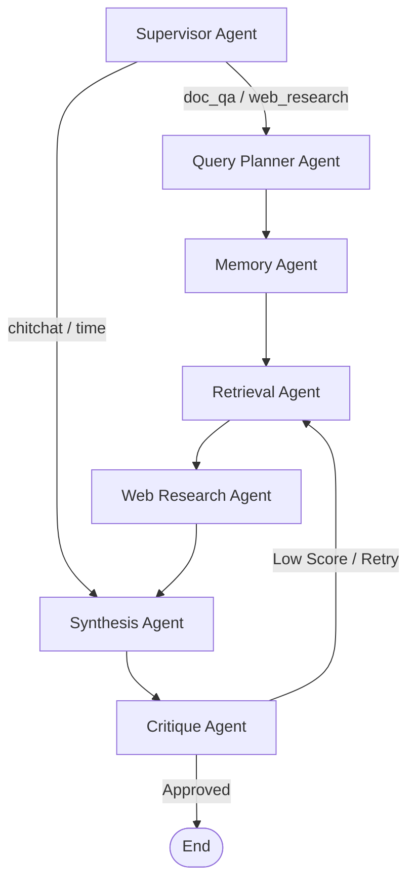

# LangGraph RAG Agent Code Study Guide

This guide provides an overview of the architecture, key files, and functionality of the multi-agent Retrieval-Augmented Generation (RAG) system.

---

## 🏗️ System Architecture & Workflow

The system is built on **LangGraph**, which models the RAG pipeline as a state machine (StateGraph). The shared message bus is the `AgentState`.



---

## 📂 Key Files & Code Functionality

### 1. State Definition (`graph_state.py`)
Defines the `AgentState` schema which acts as the shared state modified by each agent node as the query progresses.
* **Key Fields:**
  - `raw_query`: The original query from the user.
  - `standalone_query`: The pronoun-resolved version of the query.
  - `retrieved_chunks`: List of context chunks retrieved from the PDF documents database.
  - `web_snippets`: List of supplementary web search results.
  - `is_global`: Flag indicating if the query is answered globally (out of context of the PDFs).
  - `citations`: List of matching PDF citations.

---

### 2. Multi-Agent Graph Compilation (`graph.py`)
Sets up the LangGraph `StateGraph`, registers all agent nodes, links them with conditional edges, and compiles the pipeline.
* **Key Functions:**
  - `_build_graph(db_session)`: Defines the topology of the agent nodes and registers transitions.
  - `run_graph(...)`: Public entry point. Initializes state parameters, compiles the graph, and invokes execution.

---

### 3. Agent Nodes (`agents/`)

#### A. Supervisor Agent (`agents/supervisor.py`)
Classifies the user query intent into `chitchat`, `time`, `doc_qa`, or `web_research`.
* **Routing Decision:** Conditional edge routes simple queries directly to the `synthesis` node to save time and API costs, while substantive queries route to `query_planner`.

#### B. Query Planner Agent (`agents/query_planner.py`)
Optimizes the raw user query by decomposing it into up to 3 diverse sub-queries for broader vector database retrieval.

#### C. Memory Agent (`agents/memory_agent.py`)
Resolves conversational context and pronouns (e.g., "it", "they") in the query by checking MySQL conversation history.

#### D. Retrieval Agent (`agents/retrieval.py`)
Performs parallel, multi-threaded vector and keyword searches in ChromaDB for all sub-queries using a Python `ThreadPoolExecutor` to minimize latency.

#### E. Web Research Agent (`agents/web_research.py`)
* **Dynamic Relevance Classification:** Checks if the query is relevant to the PDF chunks. If it is not, it sets `is_global = True` and triggers a global web search using DuckDuckGo.
* **Anchored Search:** If the query is related to the PDF context, it uses the LLM to formulate a search query targeted specifically at supplementing the PDF content.

#### F. Synthesis Agent (`agents/synthesis.py`)
* **Dynamic Prompts:** Uses `SYNTHESIS_SYSTEM_PROMPT_IN_CONTEXT` for PDF-related answers and `SYNTHESIS_SYSTEM_PROMPT_GLOBAL` for out-of-context answers.
* **Citation Policy:**
  - **In-Context:** Generates markdown citations matching PDF sources (`[Source: filename.pdf, Page X]`).
  - **Global:** Answers using web search or LLM knowledge with absolutely **no citations** and returns an empty `citations` array.

#### G. Critique Agent (`agents/critique.py`)
Evaluates the synthesized draft answer against the context and gives it a confidence score. If it falls below the threshold (e.g., `0.7`), it triggers a re-retrieval loop up to `MAX_CRITIQUE_RETRIES`.

---

### 4. Vector DB & RAG Core (`rag.py`)
Responsible for reading documents, splitting them, creating embeddings, and running queries in ChromaDB.
* **Key Functions:**
  - `ingest_file(file_path, session_id)`: Uses `PyPDF` to parse documents, splits them into semantic chunks, and indices them.
  - `search_vector_store(query, k, session_id)`: Searches ChromaDB for the closest vector match using embeddings.

---

### 5. Database & Session Memory (`database.py` & `memory.py`)
- **`database.py`**: Manages the connection pool to the local MySQL server.
- **`memory.py`**: Tracks active sessions and saves human/AI message logs to the MySQL database.

---

### 6. FastAPI Web Server (`app.py`)
Serves the web application and runs the API endpoints:
- `/api/chat`: Runs the LangGraph multi-agent pipeline.
- `/api/upload`: Receives file uploads and calls `ingest_file`.
- `/api/stt` & `/api/tts`: Provides offline fallback and speech-to-text (Whisper/custom) and text-to-speech (local ONNX-based Piper) services.

---

## 📖 How to export this guide to PDF
To study this offline as a PDF document, you can:
1. **VS Code Markdown PDF Extension:** Install the "Markdown PDF" extension in VS Code, right-click this file, and select **"Markdown PDF: Export (pdf)"**.
2. **Pandoc:** Run the following terminal command (requires Pandoc and LaTeX installed):
   ```bash
   pandoc code_study_guide.md -o code_study_guide.pdf
   ```
3. **Browser Printing:** Open this file in any Markdown viewer, select "Print", and choose **"Save as PDF"**.
